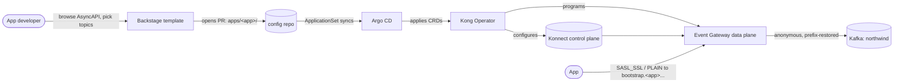

# Architecture

## Components

| Layer | What it is | In this repo |
|-------|------------|--------------|
| Developer portal | Backstage (in-cluster) — catalog of streams (AsyncAPI) + self-service templates | `catalog/`, `backstage/`, deployed via `platform/backstage/` |
| Delivery | Git + Argo CD (ApplicationSet per tenant) | `kafka-selfservice-gitops` repo |
| Control | Kong Operator reconciling Konnect + data plane from CRDs | `platform/`, config repo `apps/*/kong/` |
| Data | Kong Event Gateway data plane (KNEP) fronting Kafka | `platform/event-gateway/`, `platform/networking/` |
| Backing store | Strimzi-managed Apache Kafka (`northwind`) | `platform/kafka/` |

## How a request becomes access



## Per-application isolation

Each onboarded application gets its own **virtual cluster** on the shared Event
Gateway data plane. There is one shared listener; routing is by SNI hostname:

```
bootstrap.<app>.127-0-0-1.sslip.io  ->  virtual cluster whose dnsLabel is <app>
```

Because the SNI-forward listener policy uses `per_cluster_suffix`, onboarding a new
app never touches shared platform config. A new app is just:

- `EventGatewayVirtualCluster` (auth + prefix hiding + `enforce_on_gateway`)
- `EventGatewayVirtualClusterPolicy` of type `acls` (the topic grants)
- `TLSRoute` (SNI host for the app)

## Security model

- **Authentication is terminated at the gateway** (`mediation: terminate`). Client
  SASL/PLAIN (or OAuth) credentials are validated by Event Gateway and never reach
  Kafka; the backend connection stays anonymous. This means you grant Kafka access
  without ever touching broker-side users or Kafka ACLs.
- **Authorization is default-deny.** Virtual clusters run in `enforce_on_gateway`
  mode, so a principal has no access until an ACL rule allows it. The template only
  ever emits `allow` rules for the topics the developer selected.
- **Topic namespacing** hides the physical `RETAIL_NY.` / `WEALTH_LA.` prefixes, so
  applications depend on stable logical names, not broker layout.

## Auth options

**SASL/PLAIN** is the default (username + password, `mediation: terminate`, simplest
to demo). It's the type used because the operator's `saslScram` type does not accept
inline credentials — it carries only `algorithm` and resolves principals through Kong
Identity, so native SCRAM is an enterprise path rather than a self-contained one.

**OAuth/OIDC** is available by choosing it in the template: the virtual cluster
(`type: oauthBearer`) verifies bearer tokens against an issuer (e.g. Kong Identity) and
the ACL condition matches the token principal instead of a username. See
<https://developer.konghq.com/how-to/event-gateway/kong-identity-oauth/>.
