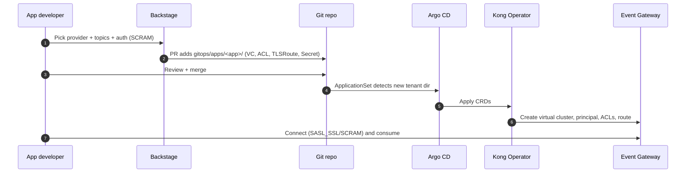
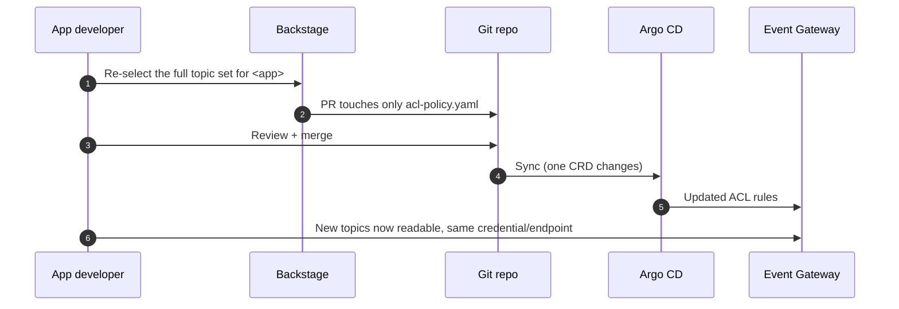

# The two flows

The demo is built around the distinction the request called out: the **first time**
you deliver everything; **afterwards** you usually just update ACLs.

## Flow 1 — First-time onboarding ("deliver everything")

Template: **Consume Kafka Topics**. Produces a full tenant directory and, combined
with the platform bootstrap, stands up the whole path.

What "deliver everything" covers:

- **Platform** (`platform/`, applied once via `platform-app.yaml` or `kubectl -k`):
  Konnect control plane, Event Gateway data plane, shared listener + TLS + SNI
  routing, the Kubernetes Gateway, and the backing Kafka cluster + topics.
- **Per app** (the Backstage PR): the virtual cluster, credentials, ACLs and route.

## Flow 2 — Add topics later ("just update the ACLs")

Template: **Add Topics to Application**. Regenerates only
`gitops/apps/<app>/kong/acl-policy.yaml`. The virtual cluster, credentials and route
are untouched, so the app keeps the same bootstrap endpoint and the same credential.

## Why this split matters

- The expensive, privileged, one-time work (control plane, data plane, backing
  cluster, certificate) is isolated in `platform/` and never re-run per request.
- The frequent, low-risk work (granting a topic) is a single-file diff a data owner
  can approve in seconds — the smallest possible blast radius.
