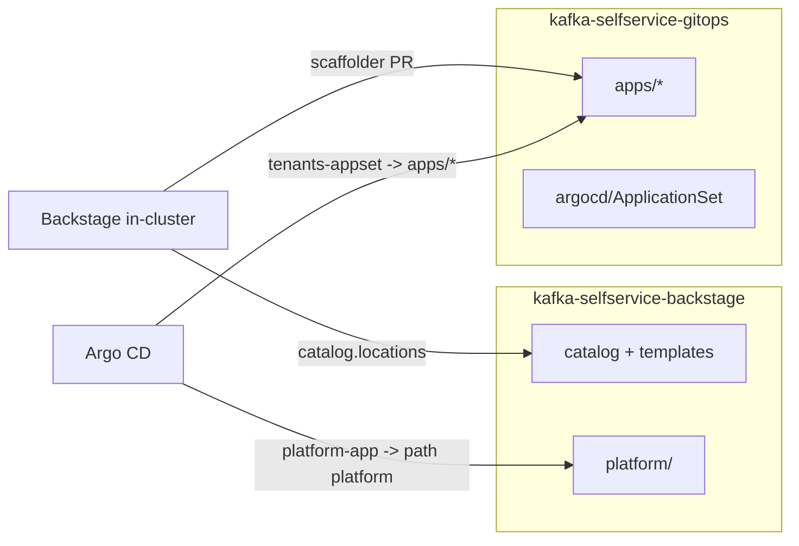

# Repository topology

This demo uses **two repositories**. They can be collapsed into one, but the split is
the more production-realistic setup and is how the templates are wired.

## The two repos

### `kafka-selfservice-backstage` (this repo) — portal / platform

Owned by the platform team; changes rarely.

- `catalog/` — AsyncAPI specs + Backstage catalog entities (the "available topics")
- `backstage/templates/` — the self-service scaffolder templates
- `platform/` — the bootstrap: Konnect control plane, Event Gateway data plane,
  Kafka, networking, and in-cluster Backstage
- `docs/`, `scripts/`, `examples/`

Backstage's `catalog.locations` points at **this repo's** `catalog-info.yaml` to load
the templates and the AsyncAPI APIs.

### `kafka-selfservice-gitops` — GitOps config

Written to constantly, by app teams via Backstage PRs.

- `apps/<app>/` — one directory per onboarded application (virtual cluster, ACLs,
  route, credentials)
- `argocd/` — the platform `Application` and the tenants `ApplicationSet`

Argo CD watches **this repo's** `apps/*`.

## Who points where

- **Backstage → portal repo**: reads catalog + templates (`catalog.locations` in
  `platform/backstage/app-config.configmap.yaml`).
- **Backstage → config repo**: the templates' `RepoUrlPicker` targets it; PRs add
  `apps/<app>/`. Nothing is committed back to the portal repo at runtime.
- **Argo CD → portal repo**: `platform-app.yaml` deploys `platform/`.
- **Argo CD → config repo**: `tenants-appset.yaml` deploys each `apps/<app>/kong/`.

## Wiring checklist

When you fork/clone, update these to your org's URLs:

| File | Repo | Set to |
|------|------|--------|
| `platform/backstage/app-config.configmap.yaml` (`catalog.locations[].target`) | portal | portal repo `catalog-info.yaml` |
| `argocd/platform-app.yaml` (`spec.source.repoURL`) | config | portal repo |
| `argocd/tenants-appset.yaml` (both `repoURL`s) | config | config repo |
| Template runs (`RepoUrlPicker` selection) | — | config repo, chosen per run |

## Prefer a single repo?

Collapse them by putting `apps/` and `argocd/` back into this repo, pointing all the
`repoURL`s and the templates at this one repo. The trade-off: onboarding-PR churn and
app-team write access land in the same repo as your platform code. Fine for a solo
demo; less so once multiple teams onboard.
